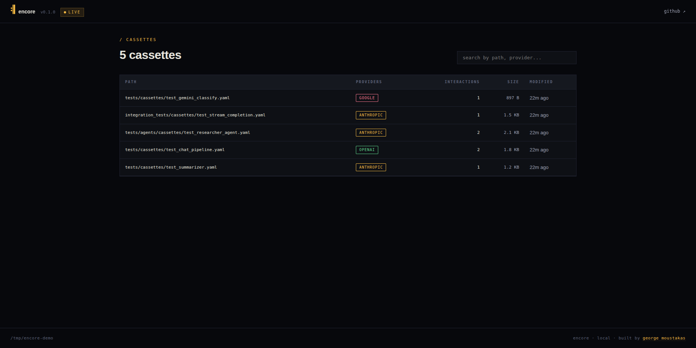
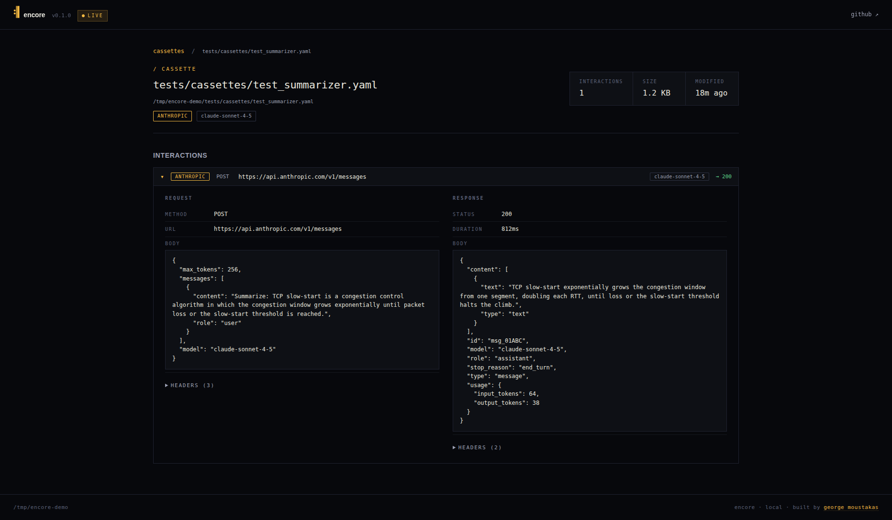

<div align="center">

# encore

**Record once. Replay forever. Test LLM-calling code without burning the API.**

[](https://pypi.org/project/encore/)
[](https://pypi.org/project/encore/)
[](https://github.com/gmoustakas/encore/actions)
[](LICENSE)

</div>

---

## The problem

If you've ever tried to write tests for code that calls an LLM, you know the drill.

- Hitting Anthropic or OpenAI in CI is **slow** (multi-second per call), **flaky** (rate limits, transient errors, sampling drift), and **expensive** (every PR run bleeds tokens).
- Hand-rolled mocks **rot the moment the SDK ships a breaking change**, and they never quite match what the real API returns.
- Existing HTTP fixtures (vcr.py, respx, pytest-vcr) work, but they don't understand LLM payloads, don't replay streamed responses faithfully, and don't scrub API keys for you.

So most teams settle for one of three bad options: skip the tests, mark them slow and skip them in CI, or write a brittle mock and pray.

## What encore does

`encore` is a test-fixture library for any Python LLM SDK that uses `httpx` under the hood (Anthropic, OpenAI, Mistral, Gemini, Cohere, Groq, DeepSeek, Together, LiteLLM, and anything else built on the standard transport).

You wrap your test in `@encore.cassette(...)`. The first time it runs, encore hits the real API and saves the request/response pair to a YAML file you commit to your repo. Every run after that replays from the file. Same response, byte-for-byte. No network calls. No flakes. No cost.

```python
import encore

@encore.cassette("tests/cassettes/test_summarizer.yaml")
def test_summarizer():
    from anthropic import Anthropic
    client = Anthropic()

    response = client.messages.create(
        model="claude-sonnet-4-5",
        max_tokens=200,
        messages=[{"role": "user", "content": "Summarize: ..."}],
    )

    assert "key point" in response.content[0].text
```

That's the whole API. One decorator. One YAML file per test. Drop it in.

## Screenshots

The library ships with a local web UI for browsing what got recorded. Run `encore web` and open `http://127.0.0.1:8095`.

**Index.** Sortable table of every cassette under your working directory. Provider, interaction count, file size, last modified. Click any row.



**Cassette detail.** Per-interaction inspector. Request and response side by side, JSON pretty-printed, headers collapsed by default, stream chunks expandable. The dashboard subscribes to filesystem events: rerun your tests in another terminal and this page updates live.



## Features

- Sync and async clients, both supported.
- Streaming responses recorded as raw SSE chunks and replayed in order at configurable speed.
- One cassette can hold multiple interactions across multiple providers.
- YAML format chosen for **git-friendly diffs** during code review.
- Auto-scrubs Anthropic and OpenAI keys, JWTs, bearer tokens, and common email regexes before writing to disk.
- Composable matchers (method, URL, model, messages, tools, temperature, ...) overridable per-cassette or globally.
- pytest plugin: zero-config fixture auto-discovers `tests/cassettes/<test_name>.yaml`.
- Local web UI with live updates as tests record (FastAPI, HTMX, SSE).
- Strictly typed: `mypy --strict` clean on the public surface.

## Install

```bash
pip install encore               # SDK + CLI
pip install "encore[web]"        # also installs the web UI
pip install "encore[all]"        # everything
```

Python 3.10+.

## Common patterns

### Decorator (simplest)

```python
@encore.cassette("test_x.yaml")
def test_x():
    ...
```

### Context manager

```python
with encore.cassette("my_run.yaml"):
    response = client.messages.create(...)
```

### pytest fixture (zero-config)

```python
def test_my_agent(encore_cassette):
    # auto-uses tests/cassettes/test_my_agent.yaml
    ...
```

### CI: forbid recording, fail on missing cassettes

```python
@encore.cassette("test_x.yaml", mode="replay_only")
def test_x():
    ...
```

Or globally:

```bash
ENCORE_DEFAULT_MODE=replay_only pytest
```

This is the mode you want in CI. It guarantees no test ever silently records a new cassette against the real API on the build server.

## Recording modes

| Mode | Behavior | When to use |
|---|---|---|
| `record_new` *(default)* | Replay if cassette exists; record and save if missing | Local dev |
| `record_once` | Record only if file empty; never re-record | First-run fixtures |
| `record_always` | Always hit the real API; overwrite the cassette | Refresh after API changes |
| `replay_only` | Never call the network; fail if cassette missing | CI |
| `bypass` | Ignore cassette entirely | Disable in one place |

## Matchers

Two requests match if they're identical on:

- HTTP method and URL
- Model
- Messages list (semantic, order-preserving)
- Tools schema
- Temperature, max_tokens, and other generation params

Override per cassette:

```python
@encore.cassette("x.yaml", match_on=["method", "url", "model", "messages"])
def test_x():
    ...
```

Or write a custom matcher:

```python
@encore.matcher
def ignore_user_id(req_a, req_b):
    a, b = req_a.body.copy(), req_b.body.copy()
    a.pop("user", None); b.pop("user", None)
    return a == b
```

## Secret scrubbing

Cassettes get committed to your repo. Anything you didn't redact will end up on GitHub. `encore` strips API keys, JWTs, and emails before write. Built-in patterns:

- Anthropic keys (`sk-ant-...`)
- OpenAI keys (`sk-...`, `sk-proj-...`)
- Generic bearer tokens
- JWTs (`eyJ...` triplets)
- Common email regex

Add your own:

```python
encore.add_scrubber(r"INTERNAL-[A-Z0-9]{16}")
```

If you find a secret pattern that should be in the default set, please open a PR.

## CLI

```bash
encore list                              # all cassettes in cwd
encore inspect tests/cassettes/x.yaml    # pretty-print one cassette
encore stats                             # interaction + size totals
encore scrub tests/cassettes/            # re-apply scrubbers in place
encore web                               # open the local web UI
```

## Web UI

```bash
encore web                               # opens http://127.0.0.1:8095
```

Dark plus ochre, mobile-responsive, zero auth. The dashboard watches the filesystem and pushes change events over SSE, so the index and cassette detail pages update in real time as your tests run in another terminal. The pulsing `live` pill in the header confirms the watcher is connected. No daemon, no persistence; it just renders the files on disk.

## Is this production-ready?

Honest answer: it works, but it's young.

What's verified:

- 48 tests, all passing. `mypy --strict` clean, `ruff` clean.
- End-to-end roundtrip against the real Anthropic SDK has been smoke-tested by the maintainer.
- Transport composition tested via `httpx.MockTransport` and `respx`.
- Used in the maintainer's own LLM projects.

What's not yet verified:

- No automated CI run against live OpenAI / Mistral / Gemini / Groq / DeepSeek endpoints. The interception logic is provider-agnostic (we intercept at the `httpx` transport layer, not the SDK layer), but each provider's SDK has quirks. If you hit one, please file an issue with a minimal repro.
- No production usage outside the maintainer's own projects yet. The library is at v0.1.0. Public API surface (`encore.cassette`, `encore.matcher`, `encore.add_scrubber`) is stable; internals may shift between 0.x minors.

Treat it like every other young open-source library: read the source if you're depending on it, and don't be surprised if you hit a rough edge. Issues and PRs welcome.

## Provider support

encore works with anything that calls an LLM provider over `httpx`. That includes:

| Provider | Status | Tested |
|---|---|---|
| Anthropic | full | end-to-end + unit |
| OpenAI | full | unit |
| Google (Gemini) | full | unit |
| Mistral | full | unit |
| Cohere | full | unit |
| Groq | full | unit |
| DeepSeek | full | unit |
| Together | full | unit |
| LiteLLM | indirect (passes through provider URL) | not tested directly |

"full" means the transport detects the provider by hostname and tags interactions accordingly. If you use a provider not in this list, encore will still record and replay it; you just won't get the colored provider pill in the UI.

## Comparison

|                                | vcr.py | pytest-vcr | RESPX | **encore** |
|---|---|---|---|---|
| HTTP-level                     | yes | yes | yes | yes |
| LLM-payload aware              | no  | no  | no  | yes |
| Streaming response replay      | partial | partial | no | yes |
| Provider-agnostic              | yes | yes | yes | yes |
| Auto API-key scrubbing         | manual | manual | no | yes |
| pytest plugin                  | manual | yes | no | yes |
| Web UI with live updates       | no | no | no | yes |

## Publishing to PyPI (for maintainers)

This section is for me. If you're not me, you can skip it.

1. Bump the version in `src/encore/_version.py`.
2. Update `CHANGELOG.md`.
3. Tag and push:

   ```bash
   git tag v0.1.1
   git push --tags
   ```

4. Clean and build:

   ```bash
   rm -rf dist build *.egg-info
   python -m build
   twine check dist/*
   ```

5. Upload to TestPyPI first to catch metadata errors:

   ```bash
   twine upload --repository testpypi dist/*
   pip install -i https://test.pypi.org/simple/ encore  # in a clean venv, sanity check
   ```

6. Upload to PyPI for real:

   ```bash
   twine upload dist/*
   ```

You'll need:

- A PyPI account at https://pypi.org/account/register/
- A scoped API token from https://pypi.org/manage/account/token/ (project name `encore`)
- That token in `~/.pypirc`:

  ```ini
  [pypi]
  username = __token__
  password = pypi-AgEIcHlwaS5vcmc...  # your token

  [testpypi]
  repository = https://test.pypi.org/legacy/
  username = __token__
  password = pypi-...
  ```

`build` and `twine` are already in the `[dev]` extra. After the first publish, future releases can be automated via a GitHub Actions workflow using OIDC trusted publishing; see `.github/workflows/ci.yml` for the CI runner if you want to extend it.

## License

MIT. Built by [George Moustakas](https://www.georgemou.gr/) in Greece.
